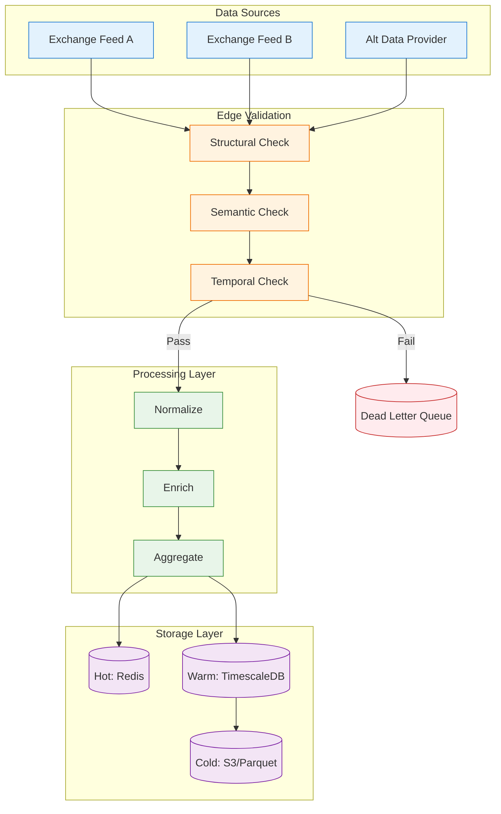

<div align="center">
  
</div>

# Market Data Pipeline

> **"Data Physics" - The discipline that makes AI systems reliable.**

[](https://github.com/shifujosh/Market-Data-Pipeline-Ref-/actions/workflows/schema_validation.yml)

A reference architecture demonstrating enterprise-grade data validation patterns learned from managing high-frequency financial data pipelines. These same principles power the "Trust Layer" in my AI systems.

---

## The Origin Story

Before building AI systems, I managed data pipelines for global financial institutions. The stakes were high: a single corrupted data point could cascade into millions of dollars in trading errors.

This taught me what I call **Data Physics**—treating data as a physical asset with laws that must be respected.

---

## Core Principles

### 1. Schema is Contract

In high-frequency environments, schema changes are breaking changes:

```typescript
// Every field is explicitly typed and validated
const TickDataSchema = z.object({
  symbol: z.string().min(1).max(10),
  price: z.string().transform(toDecimal).refine(v => v.gt(0)),
  volume: z.number().int().min(0),
  timestamp: z.string().datetime({ offset: true }),
  sequenceId: z.number().int().optional(),
});
```

### 2. Validate at the Edge

Data quality degrades the further you get from the source. The first ingestion point is the last chance to catch garbage.

| Validation Type | What It Catches |
|----------------|-----------------|
| **Structural** | Missing fields, wrong types |
| **Semantic** | Price = $0.00 or $999,999 |
| **Temporal** | Stale data, future timestamps |
| **Contextual** | 50% price jump in 1 second |

### 3. Fail Loudly

Silent failures are the most expensive. A pipeline that drops records without logging is worse than one that crashes.

```typescript
// Dead Letter Queue - nothing disappears silently
interface DeadLetterRecord {
  originalData: unknown;
  errors: ValidationError[];
  timestamp: string;
  retryCount: number;
}
```

### 4. Audit Everything

In regulated environments, "trust me" is not an answer:

- **Lineage**: Where did this value come from?
- **Timestamps**: When was it ingested, transformed, written?
- **Diffs**: What changed between versions?

---

## Architecture



---

## Key Innovations

### 1. Data Inertia

Financial data has "inertia" - prices don't jump 50% in a millisecond. We track context to detect anomalies:

```typescript
class SymbolContext {
  lastPrice: Decimal;
  priceHistory: Decimal[];     // Rolling window
  volatility: number;          // σ for this symbol
  
  isAnomalous(newPrice: Decimal): boolean {
    const change = newPrice.minus(this.lastPrice).abs();
    const threshold = this.volatility * 3; // 3σ rule
    return change.div(this.lastPrice).gt(threshold);
  }
}
```

### 2. Tiered Quality Scoring

Not all validation failures are equal:

| Quality Level | Meaning | Action |
|--------------|---------|--------|
| **VERIFIED** | All checks pass | Proceed |
| **SUSPECT** | Soft rule failed | Flag for review |
| **REJECTED** | Hard rule failed | Dead letter queue |

### 3. Backpressure Handling

When downstream systems can't keep up:

```typescript
interface BackpressureConfig {
  maxQueueDepth: number;
  sampleRate: number;      // 1.0 = all, 0.1 = 10%
  dropPolicy: 'oldest' | 'newest' | 'random';
}
```

---

## Project Structure

```text
├── ts/                     # TypeScript implementation
│   ├── src/
│   │   ├── types/          # Zod schemas
│   │   └── validators/     # Validation rules
│   └── tests/              # Vitest tests
├── src/                    # Python implementation
│   └── ingestion_engine.py # ETL pipeline
├── schema/                 # SQL definitions
│   └── market_data.sql     # TimescaleDB schema
├── docs/                   # Documentation
│   ├── ARCHITECTURE.md     # System overview
│   └── adr/                # Decision records
└── examples/               # Usage examples
```

---

## Technology Stack

| Component | Technology | Purpose |
|-----------|------------|---------|
| **Validation** | Zod (TypeScript) | Runtime schema enforcement |
| **Precision** | decimal.js | Financial-grade arithmetic |
| **Storage** | TimescaleDB | Time-series optimized |
| **Queue** | Kafka/Redis Streams | High-throughput ingestion |
| **Monitoring** | Prometheus + Grafana | Latency, error rates |

---

## Quick Start

```bash
# TypeScript
cd ts && npm install && npm test

# Python
pip install -r requirements.txt
python src/ingestion_engine.py
```

---


## Why This Matters for AI

AI systems are probabilistic - they guess. Financial pipelines are deterministic - they verify.

I apply the same discipline to AI:

1. **Validate inputs** before they reach the model
2. **Verify outputs** before they reach users
3. **Audit everything** for debugging and compliance

This is the foundation of the "Trust Layer" in my AI projects.

---

## Documentation

- [Architecture Details](docs/ARCHITECTURE.md)
- [ADR: Tiered Validation](docs/adr/001-tiered-validation.md)
- [ADR: Dead Letter Strategy](docs/adr/002-dead-letter-strategy.md)

---

## License

MIT License - See [LICENSE](LICENSE)

---

> **[Back to Profile](https://github.com/shifujosh)**
