# Reference: Financial Data Pipeline

> *The discipline that makes AI systems reliable.*

---

## The Origin

Before I built AI systems, I managed data pipelines for global financial institutions. The stakes were high: a single bad data point could cascade into millions of dollars in trading errors.

This taught me what I call **Data Physics**—the principle that data must be treated like a physical asset. If the structure is wrong, everything downstream breaks.

---

## Why This Matters for AI

AI systems are probabilistic. They guess. Financial pipelines are deterministic. They verify.

I apply the same rigor from high-frequency trading to my AI work:

- **Strict Schemas:** Every data point has a defined type. No drift allowed.
- **Validation Gates:** Data is checked before it enters the system, not after.
- **Audit Trails:** Every transformation is logged for debugging.

```mermaid
flowchart LR
    classDef input fill:#1e293b,stroke:#3b82f6,stroke-width:1px,color:#93c5fd;
    classDef process fill:#1e293b,stroke:#a855f7,stroke-width:2px,color:#d8b4fe;
    classDef verify fill:#1e293b,stroke:#ef4444,stroke-width:2px,color:#fca5a5;
    classDef store fill:#064e3b,stroke:#10b981,stroke-width:2px,color:#6ee7b7;

    Raw["Raw Data"]:::input --> Ingest["Ingest"]:::process
    Ingest --> Validate{"Validate"}:::verify
    Validate -->|Pass| Transform["Transform"]:::process
    Validate -->|Fail| Reject["❌ Reject"]:::verify
    Transform --> Store[("Store")]:::store
    Store --> Audit["📋 Audit Log"]:::input
```

This discipline is the foundation of the "Trust Layer" in my AI projects.

---

## What is in This Repo

This is a **sanitized reference architecture**—not proprietary code. It demonstrates the principles I use:

| File | Purpose |
| :--- | :--- |
| `src/ingestion_engine.py` | Data transformation with validation |
| `schema/market_data.sql` | Strict schema definition |
| `pipeline_config.yaml` | Environment-specific configuration |

---

> **[Back to Profile](https://github.com/shifujosh)**
