# Reference: Financial Data Pipeline

> *The discipline that makes AI systems reliable.*

---

## The Origin

Before I built AI systems, I managed data pipelines for global financial institutions. The stakes were high: a single bad data point could cascade into millions of dollars in trading errors.

This taught me what I call **Data Physics**—the principle that data must be treated like a physical asset. If the structure is wrong, everything downstream breaks.

---

## The Principles

### 1. Schema is Contract

In high-frequency environments, schema changes are breaking changes. I learned to treat schemas like APIs:

- **Versioning:** Every schema change is versioned and backward-compatible.
- **Nullability:** Explicit. No implicit defaults hiding missing data.
- **Types:** Precise. A `timestamp with timezone` is not a `string`.

### 2. Validate at the Edge

Data quality degrades the further you get from the source. The first ingestion point is the last chance to catch garbage.

- **Structural validation:** Does the payload match the expected shape?
- **Semantic validation:** Is the value within realistic bounds? (A stock price of $0.00 or $999,999 should trigger alerts.)
- **Temporal validation:** Is this data from the future? Is it stale?

### 3. Fail Loudly

Silent failures are the most expensive. A pipeline that drops records without logging is worse than one that crashes.

- **Dead letter queues:** Rejected records go somewhere reviewable, not into the void.
- **Alerting thresholds:** If validation rejects more than N% of a batch, escalate immediately.
- **Idempotency:** Every operation is safe to retry.

### 4. Audit Everything

In regulated environments, "trust me" is not an answer. Every transformation must be traceable.

- **Lineage:** Where did this value come from?
- **Timestamps:** When was it ingested, transformed, and written?
- **Diffs:** What changed between versions?

---

## Why This Matters for AI

AI systems are probabilistic. They guess. Financial pipelines are deterministic. They verify.

I apply the same rigor to my AI work:

```mermaid
flowchart TD
    classDef input fill:#1e293b,stroke:#3b82f6,stroke-width:1px,color:#93c5fd;
    classDef schema fill:#1e293b,stroke:#f59e0b,stroke-width:2px,color:#fbbf24;
    classDef validate fill:#1e293b,stroke:#a855f7,stroke-width:2px,color:#d8b4fe;
    classDef fail fill:#2a1a1a,stroke:#ef4444,stroke-width:2px,color:#fca5a5;
    classDef store fill:#064e3b,stroke:#10b981,stroke-width:2px,color:#6ee7b7;
    classDef audit fill:#1e293b,stroke:#0ea5e9,stroke-width:2px,color:#7dd3fc;

    Raw["Raw Data"]:::input
    
    subgraph Schema ["📋 Schema is Contract"]
        Raw --> Parse["Parse Against Schema"]:::schema
    end
    
    subgraph Edge ["🛡️ Validate at Edge"]
        Parse --> Struct{"Structure?"}:::validate
        Struct -->|Pass| Semantic{"Semantics?"}:::validate
        Semantic -->|Pass| Temporal{"Temporal?"}:::validate
    end
    
    subgraph Loud ["🔊 Fail Loudly"]
        Struct -->|Fail| DLQ["Dead Letter Queue"]:::fail
        Semantic -->|Fail| DLQ
        Temporal -->|Fail| DLQ
        DLQ --> Alert["⚠️ Alert"]:::fail
    end
    
    Temporal -->|Pass| Transform["Transform"]:::store
    Transform --> Store[("Store")]:::store
    
    subgraph Log ["📜 Audit Everything"]
        Store --> Lineage["Lineage"]:::audit
        Store --> Timestamps["Timestamps"]:::audit
        Store --> Diffs["Diffs"]:::audit
    end
```

This discipline is the foundation of the "Trust Layer" in my AI projects.

---

## What is in This Repo

This is a **sanitized reference architecture**—not proprietary code. It demonstrates the patterns I use:

| File | Purpose |
| :--- | :--- |
| `src/ingestion_engine.py` | Data transformation with validation |
| `schema/market_data.sql` | Strict schema definition |
| `pipeline_config.yaml` | Environment-specific configuration |

---

> **[Back to Profile](https://github.com/shifujosh)**
